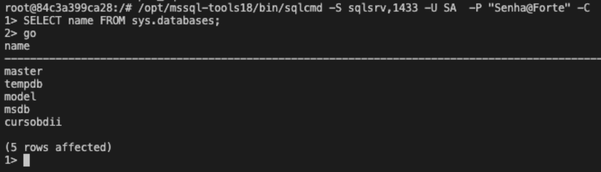
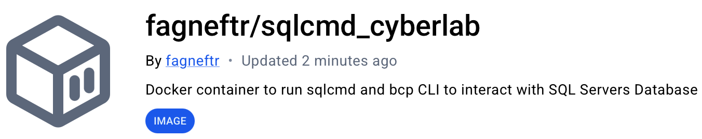

# SqlCmd CyberLab

# Quick Start 

```bash
docker run --rm -it fagneftr/sqlcmd_cyberlab:latest
```

### Interacting with  MSSQL Databases

#### Use Cases
Atfer start runing the container, you can use the available comands: sqlcmd, bcp and ping

```bash
root@ffae2e88e9b1:/# ping -c2 10.10.10.10

root@ffae2e88e9b1:/# sqlcmd -S <IP_HOST>,<PORT> -U user -P Pass@word -d Database -C 

root@ffae2e88e9b1:/# bcp "SELECT...;" queryout table.csv -S <IP_HOST>,<PORT> -U user -P Pass@word -c -t";"
```




# Docker Hub Repository [fagneftr/sqlcmd_cyberlab](https://hub.docker.com/r/fagneftr/sqlcmd_cyberlab)



# Building the Image

You can edit  and recompile the image using:

```bash
docker build --file ./Dockerfile -t new_sqlcmd .

# After building you can use it 
docker run -it new_sqlcmd:latest
```